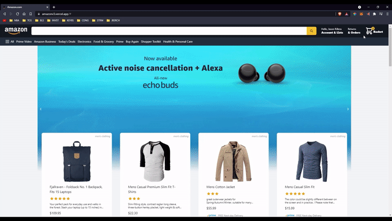
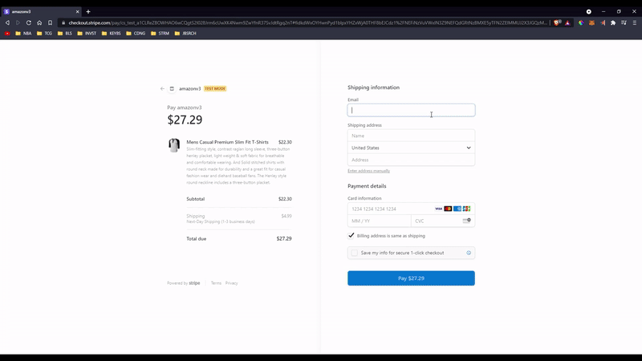

# Amazon Clone

This website is an e-commerce website inspired by amazon's functionality and layout. It was build with Next.js, utilizes the Google Firebase for the backend, the stripe API for payment processing, and responsively designed through the use of Tailwind CSS.

## Features

- Maximized applications’ efficiency, data quality, operability, and flexibility with Next.js and Tailwind CSS.
- Leveraged Google Firebase to increase scalability of the deployed site and integrated NextAuth to enhance user security and data protections.
- Utilized payment functionality from Stripe API for a seamless customer experience.

## Author

Jason Rillera: https://github.com/JasonRillera

## [Live Demo](https://amazonv3.vercel.app/)

###### Home Page

###### Basket

###### Stripe Payment Process

